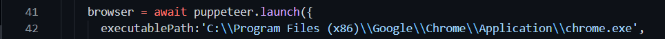

title, PS, cli based approach completely done on node.js, end drive link, 

# **Team-HaxxOn DEV04**

### **Problem Statement: Derive a user’s LinkedIn Profile URL as Output using only the linked e-mail address as input.**
### We solved this PS using a CLI through node.js
 

### Our approach is to use Outlook to retrieve a person's LinkedIn url through their associated email id.
 

# **How to run**
1. ### Clone the repo to your system
`git clone https://github.com/girish-j04/TRINIT_Haxxon_DEV04.git`

2. ### Install the node packages
`npm install`

### **Note: If you haven't installed chrome on the default location, add the correct path to the bharatx.js file on line 42 before running the bharatx.js file.**

### Your path to the chrome.exe file should be added similar to what is shown by the image below.

3. ### Add the Email Id to ./csvfiles/contacts.csv file. 
**Note that only one email id can be fed into the csv file and do not change the "E-mail Address" header in the file.**
  
4. ### Now run the bharatx.js script in the same directory
`node bharatx`

5. ### You'll find the linkedin url printed on the command line

 

## **Drive Link for the live implementation:** 